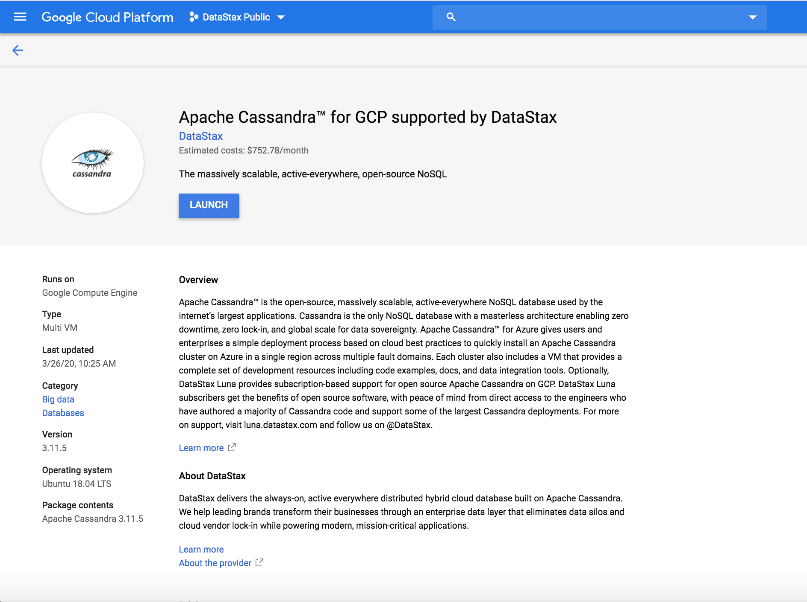
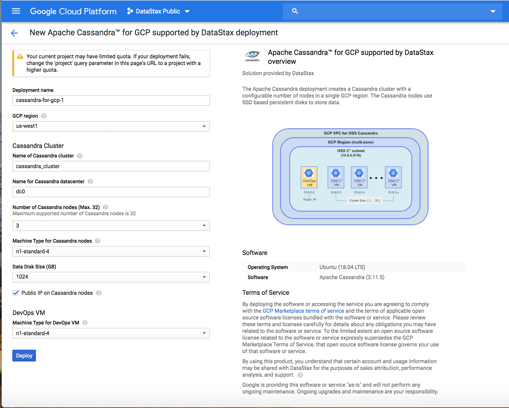
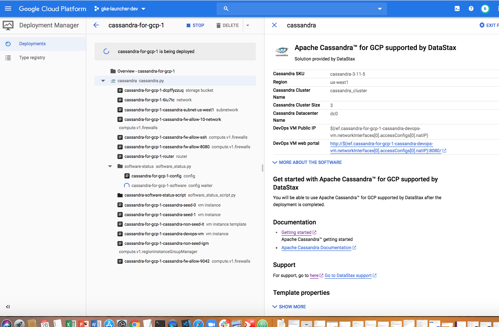
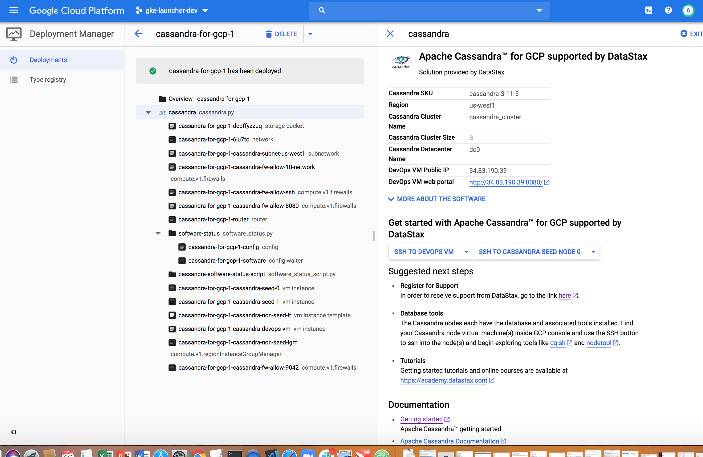
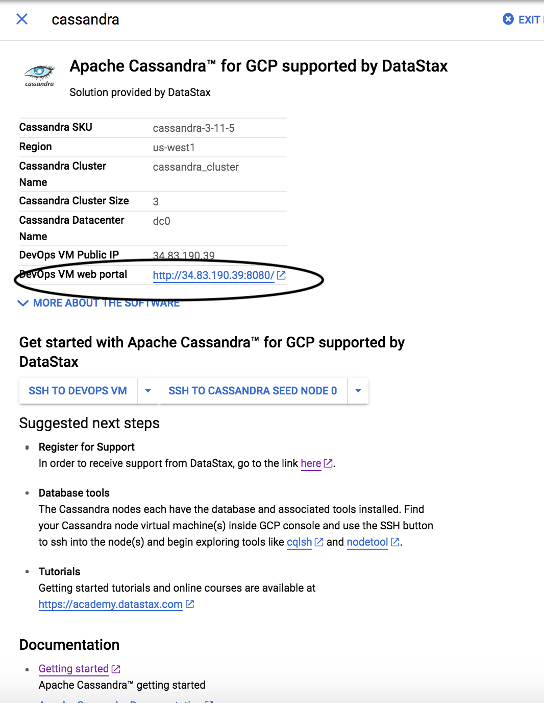
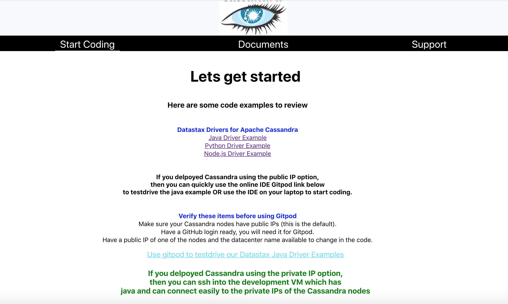
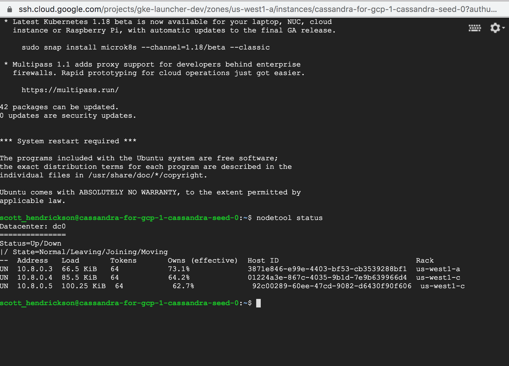
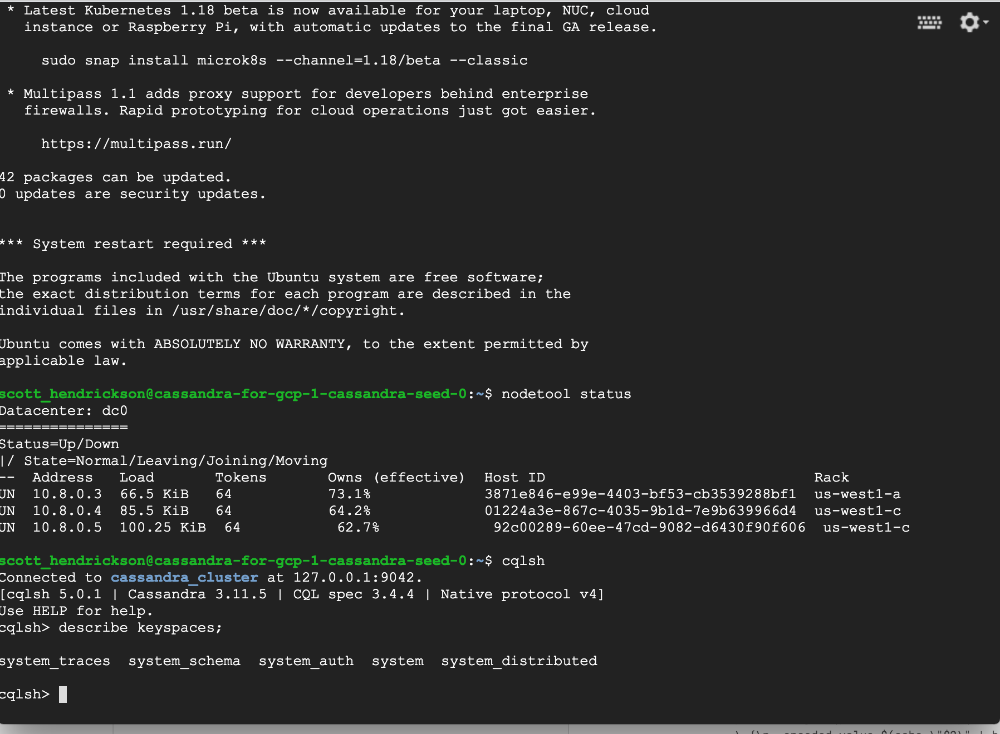
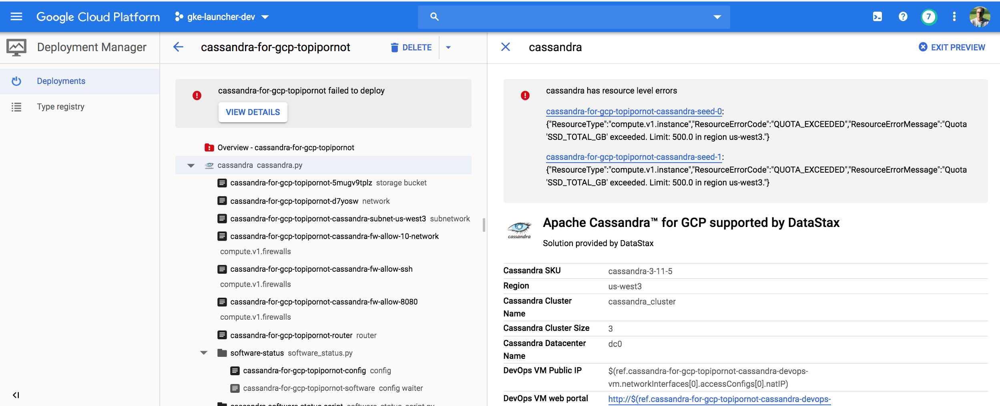
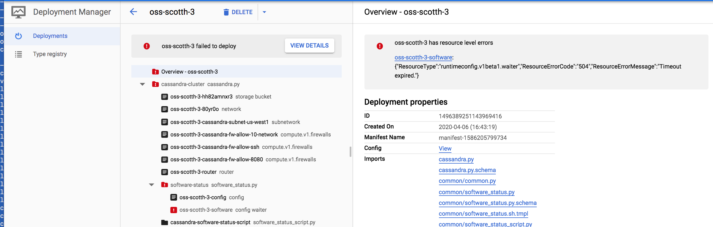

# Apache Cassandra Google Cloud Launcher

## Deploying
Let's deploy an Apache Cassandra cluster on GCP.  Simply go to https://console.cloud.google.com/launcher/details/datastax-public/cassandra-for-gcp

Click "Launch on Compute Engine"

You can take the default settings or customize them.  When complete click "Deploy"

Your cluster is now deploying.

## Inspecting the Cluster

When complete you should see:

To get started, click on the DevOps VM web portal URL:

This will take you to the getting started page and here you will have access to documents and how to get support:

Next you can  log into a node to interact with the database.  To do that go back to the Google console and  start an ssh session on one of the Cassandra nodes using the "Open in browser window" option. Once you on the VM type in "nodetool status":

You can also run "cqlsh" and describe the keyspaces:

## Possible Errors

It is possible for deployments to fail. One reason might be that your GCP project doesn't have enough quota to allocate the resources needed for your cluster. In this case you will see an error like below. 

From the GCP console, go to the deployment manager and delete the failed deployment. Ask your GCP admin to increase your quota and run the delployment again.

Another reason for failure is because of deployment timeouts. This can happen because you have a bad network connection. In this case you will see an error like below.

From the GCP console, go to the deployment manager and delete the failed deployment and then run the delployment again.

## Next Steps

If you want to learn more about DataStax Enterprise, the online training courses at https://academy.datastax.com/ are a great place to start.

To learn more about support for this offer go to https://luna.datastax.com.
