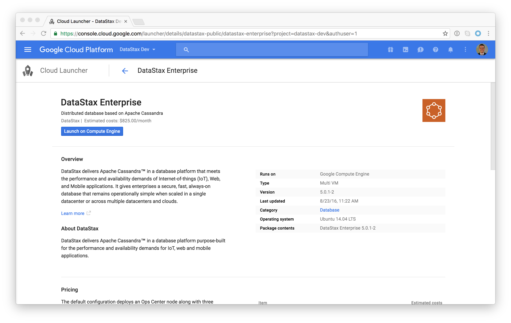
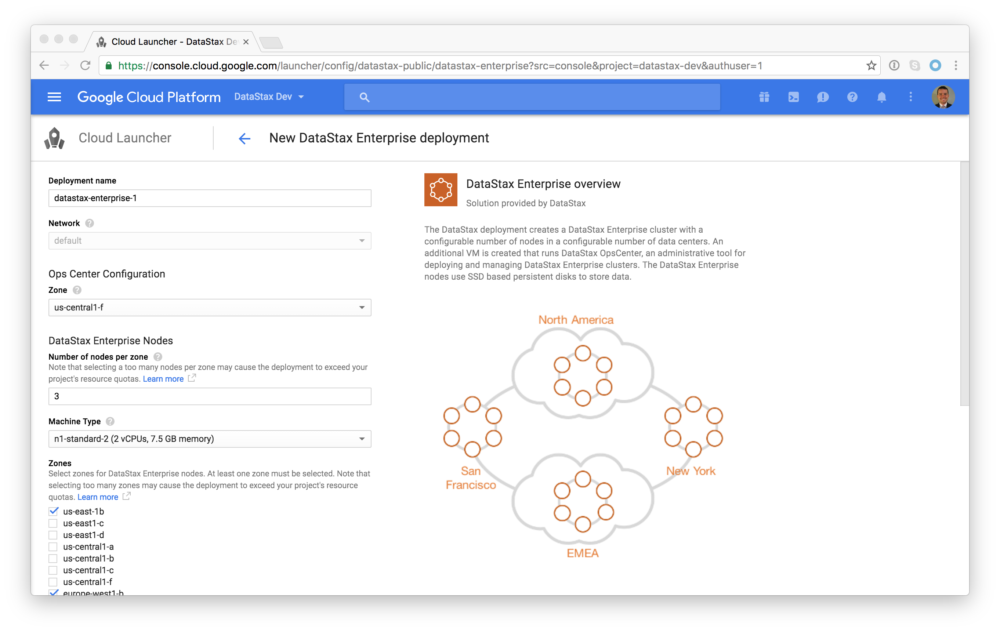
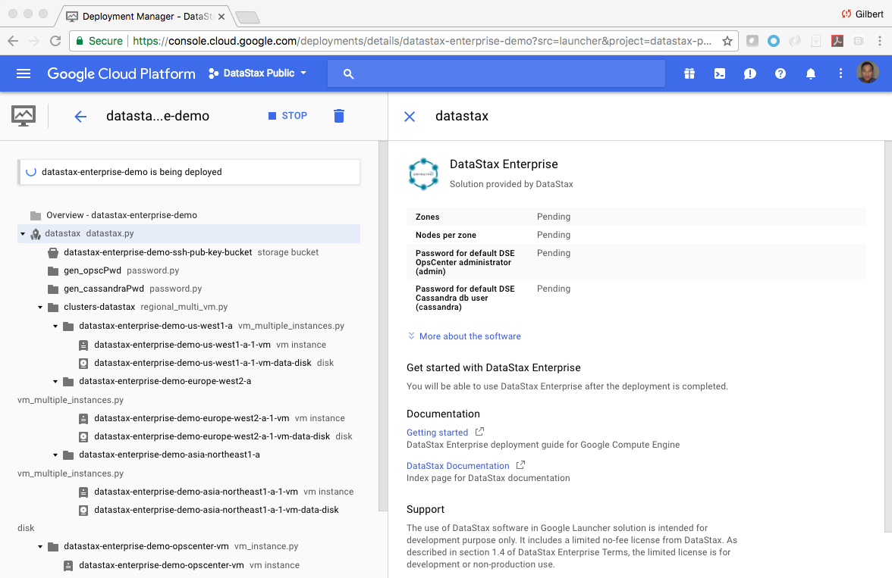
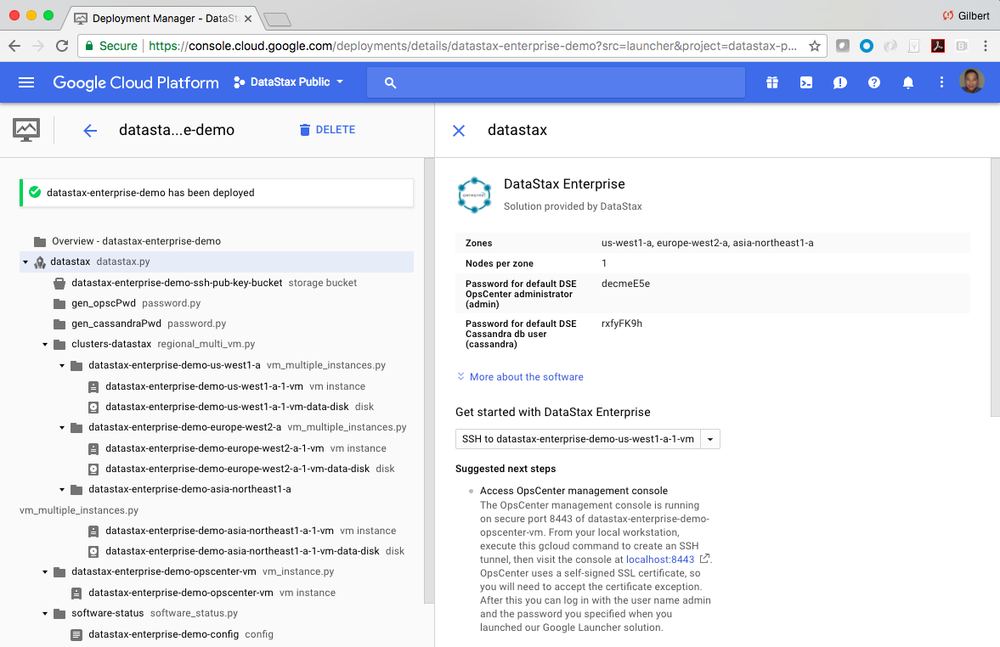
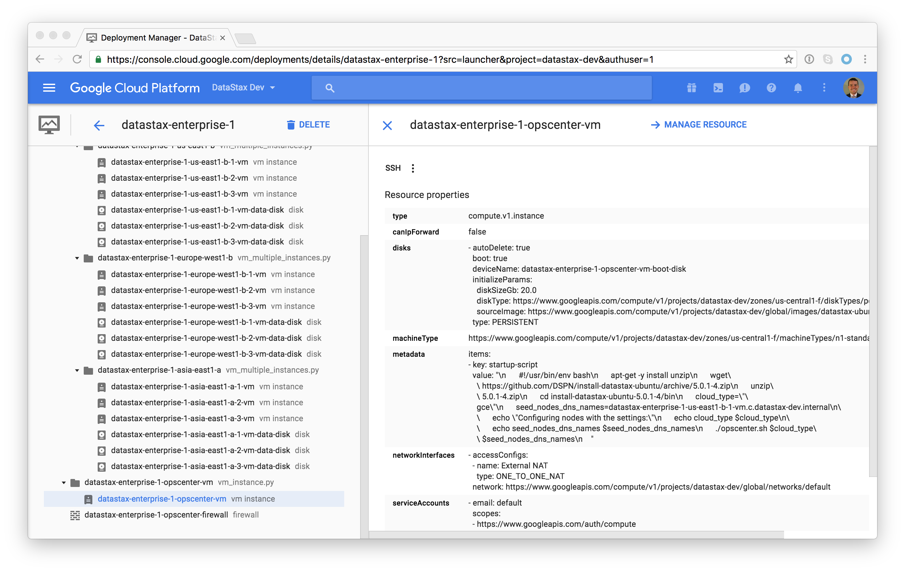
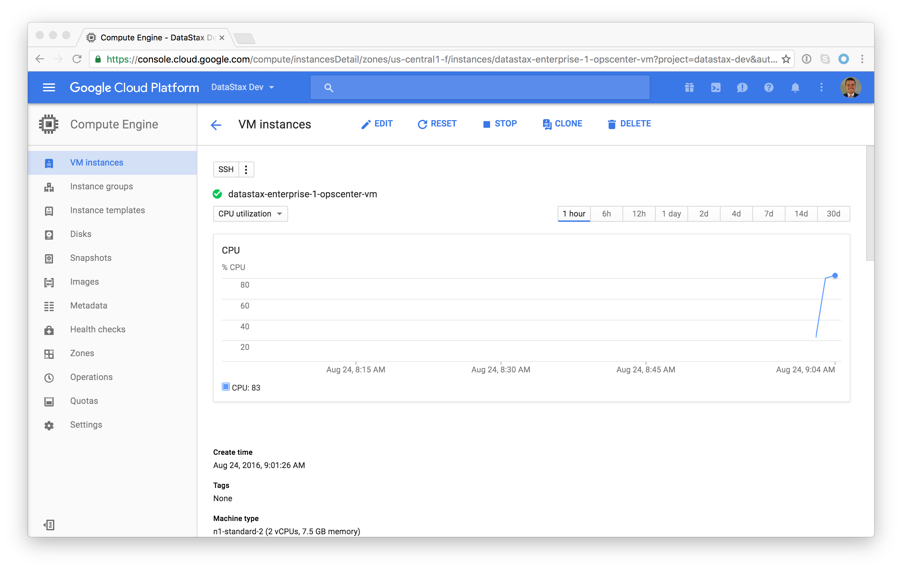
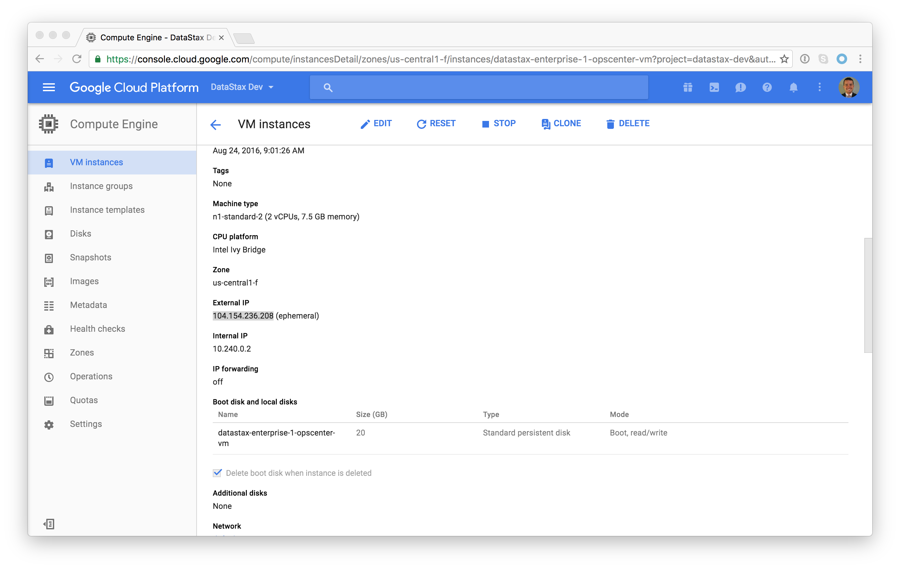
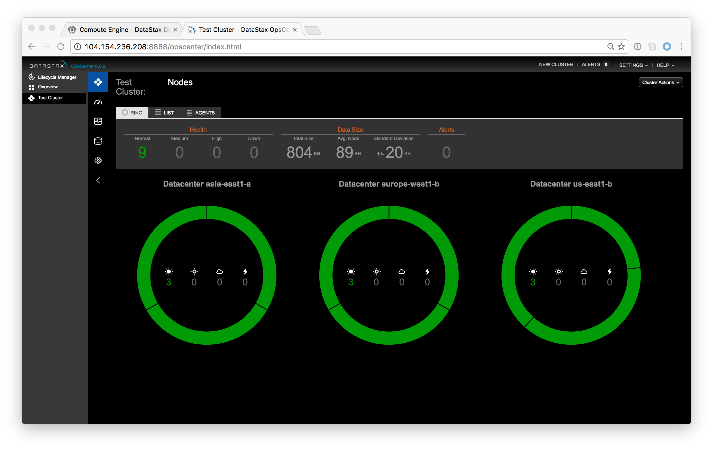
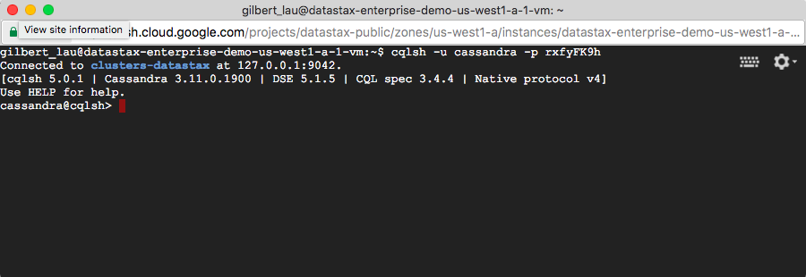

# Google Cloud Launcher

## Deploying
First off we're going to deploy a cluster.  That's really easy with Cloud Launcher.  Simply go to https://console.cloud.google.com/launcher/details/datastax-public/datastax-enterprise

Click "Launch on Compute Engine"

You can take the default settings or customize them.  When complete click "Deploy"

That's it!  You're cluster is now deploying.

## Inspecting the Cluster

The infrastructure will take a few minutes to deploy.  When complete you should see:

Scroll down to the OpsCenter machine and select it:

Click "Manage Resource"

Scroll down to the external IP and select it

To view OpsCenter, the DataStax admin interface, open a web browser to port 8888 on the external IP.  Note, if you do this very soon after deployment, the cluster may not have completed setup yet.

Great!  You now have a DataStax Enterprise cluster running with 3 nodes in Asia, Europe and America.

We can also log into a node to interact with the database.  To do that go back to the Google console and click the back arrow in the upper left.  This will return you to the view of the deployment.

Click on any node.  In DataStax Enterprise the nodes are homogeneous so we can interact with any one.

We can connect to that node by clicking "SSH."  This will open an SSH window.

At this point we can clear the terminal window and start up cqlsh, the command line interface to DataStax Enterprise.

    clear
    cqlsh

From there you can issue any valid cql command.  For instance:

    desc keyspace
    

    
## Next Steps

If you want to learn more about DataStax Enterprise, the online training course at https://academy.datastax.com/ are a great place to start.

To learn more about running DataStax Enterprise on GCP take a look at the [bestpractices guide](bestpractices.md) and [post deploy steps](postdeploy.md).